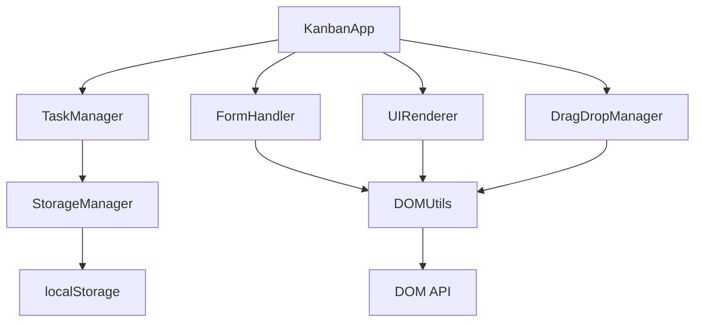

# 🚀 Dynamic Kanban Board

A modern, responsive Kanban board application built with vanilla JavaScript, HTML, and CSS. Features drag-and-drop functionality, persistent data storage, and a modular architecture.


## 📋 Table of Contents

- [Features](#features)
- [Demo](#demo)
- [Installation](#installation)
- [Usage](#usage)
- [Architecture](#architecture)
- [API Documentation](#api-documentation)
- [Browser Support](#browser-support)
- [Contributing](#contributing)
- [License](#license)

## ✨ Features

### Core Functionality
- ✅ **Task Creation** - Add tasks with title and description
- ✅ **Drag & Drop** - Seamlessly move tasks between columns
- ✅ **Three Columns** - To Do, In Progress, Done
- ✅ **Persistent Storage** - Tasks saved in localStorage
- ✅ **Task Deletion** - Remove tasks with confirmation

### UI/UX Enhancements
- 🎨 **Modern Design** - Beautiful gradients and animations
- 📱 **Responsive Layout** - Works on mobile and desktop
- ⚡ **Smooth Interactions** - Hover effects and transitions
- 🎯 **Visual Feedback** - Drag states and drop zones
- 🔤 **Form Validation** - User-friendly error messages

### Technical Features
- 🏗️ **Modular Architecture** - Clean separation of concerns
- 🛠️ **Reusable Utilities** - DRY principle implementation
- 🔒 **Error Handling** - Robust error management
- 📝 **Well Documented** - Comprehensive code comments
- ⚡ **Performance Optimized** - Efficient DOM manipulation

## 🎯 Demo

### Quick Start
1. Download the HTML file
2. Open in any modern web browser
3. Start creating and organizing tasks!

### Live Preview
The application works entirely in the browser with no server requirements.

## 🚀 Installation

### Option 1: Direct Download
```bash
# Clone or download the HTML file
curl -O https://your-repo-url/kanban-board.html
```

### Option 2: Clone Repository
```bash
git clone https://github.com/your-username/dynamic-kanban-board.git
cd dynamic-kanban-board
```

### Option 3: CDN (Future)
```html
<!-- Include via CDN (when available) -->
<script src="https://cdn.example.com/kanban-board/v1.0.0/kanban.min.js"></script>
```

## 💻 Usage

### Basic Usage

1. **Adding Tasks**
   ```
   1. Fill in the task title (required)
   2. Add an optional description
   3. Click "Add Task" button
   4. Task appears in "To Do" column
   ```

2. **Moving Tasks**
   ```
   1. Click and drag any task card
   2. Drop it on the desired column
   3. Task status updates automatically
   4. Changes are saved instantly
   ```

3. **Deleting Tasks**
   ```
   1. Hover over any task card
   2. Click the red "×" button
   3. Confirm deletion in the dialog
   4. Task is permanently removed
   ```

### Advanced Features

#### Keyboard Shortcuts
- `Tab` - Navigate between form fields
- `Enter` - Submit form (when in input fields)
- `Escape` - Cancel task deletion dialog

#### Data Management
- All tasks are automatically saved to localStorage
- Data persists across browser sessions
- No manual save required

## 🏗️ Architecture

The application follows a modular architecture with clear separation of concerns:

```
📁 Project Structure
├── 🎨 Styles (CSS)
│   ├── Layout & Grid System
│   ├── Component Styling
│   ├── Animations & Transitions
│   └── Responsive Design
│
├── 🧩 JavaScript Modules
│   ├── DOMUtils - DOM manipulation utilities
│   ├── StorageManager - localStorage operations
│   ├── TaskManager - Task CRUD operations
│   ├── UIRenderer - DOM rendering logic
│   ├── DragDropManager - Drag & drop functionality
│   ├── FormHandler - Form validation & submission
│   └── KanbanApp - Application controller
│
└── 📄 HTML Structure
    ├── Header Section
    ├── Task Creation Form
    └── Kanban Board Columns
```

### Module Dependencies



## 📖 API Documentation

### Core Modules

#### `DOMUtils`
Reusable DOM manipulation utilities.

```javascript
// Create element with attributes
DOMUtils.createElement('div', { className: 'task-card' }, 'Content');

// Find element with error handling
DOMUtils.findElement('#taskForm');

// Add event listener safely
DOMUtils.addEventHandler(element, 'click', handler);
```

#### `TaskManager`
Handles all task-related operations.

```javascript
// Create new task
TaskManager.createTask('Task Title', 'Description');

// Update task status
TaskManager.updateTaskStatus('task_id', 'done');

// Get tasks by status
TaskManager.getTasksByStatus('todo');

// Delete task
TaskManager.deleteTask('task_id');
```

#### `StorageManager`
localStorage wrapper with error handling.

```javascript
// Save tasks to storage
StorageManager.saveTasks(tasksArray);

// Load tasks from storage
const tasks = StorageManager.loadTasks();

// Clear all tasks
StorageManager.clearTasks();
```

### Task Object Structure

```javascript
{
  id: 'task_1234567890_abc123def',     // Unique identifier
  title: 'Task Title',                  // Required field
  description: 'Task description',      // Optional field
  status: 'todo|inprogress|done',      // Current status
  createdAt: '2024-01-15T10:30:00Z'    // ISO timestamp
}
```

### Event System

#### Custom Events
The application uses standard DOM events with custom handling:

```javascript
// Task creation
document.addEventListener('task:created', (e) => {
    console.log('New task:', e.detail.task);
});

// Task status change
document.addEventListener('task:moved', (e) => {
    console.log('Task moved:', e.detail);
});
```

## 🌐 Browser Support

| Browser | Version | Status |
|---------|---------|---------|
| Chrome  | 60+     | ✅ Full Support |
| Firefox | 55+     | ✅ Full Support |
| Safari  | 12+     | ✅ Full Support |
| Edge    | 79+     | ✅ Full Support |
| IE      | 11      | ⚠️ Limited Support |

### Required Features
- ES6+ JavaScript support
- CSS Grid and Flexbox
- localStorage API
- Drag and Drop API
- HTML5 form validation

## 🎨 Customization

### Themes
Modify CSS custom properties for easy theming:

```css
:root {
  --primary-gradient: linear-gradient(135deg, #667eea 0%, #764ba2 100%);
  --todo-color: linear-gradient(135deg, #ff6b6b, #ee5a24);
  --progress-color: linear-gradient(135deg, #feca57, #ff9ff3);
  --done-color: linear-gradient(135deg, #48CAE4, #0077B6);
}
```

### Column Configuration
Add new columns by extending the HTML and JavaScript:

```javascript
// Add new status to TaskManager
const STATUSES = ['todo', 'inprogress', 'review', 'done'];
```

### Custom Validation
Extend form validation in `FormHandler`:

```javascript
validateForm(title, description) {
    // Add custom validation rules
    if (title.includes('forbidden')) {
        alert('Title contains forbidden words');
        return false;
    }
    return true;
}
```

## 🧪 Testing

### Manual Testing Checklist

#### Task Creation
- [ ] Create task with title only
- [ ] Create task with title and description
- [ ] Validate empty title handling
- [ ] Test long title/description handling

#### Drag & Drop
- [ ] Drag task between all columns
- [ ] Test drag visual feedback
- [ ] Verify drop zone highlighting
- [ ] Test drag cancellation (ESC key)

#### Persistence
- [ ] Refresh browser and verify tasks remain
- [ ] Close/reopen browser tab
- [ ] Test localStorage quota exceeded

#### UI/UX
- [ ] Test responsive design on mobile
- [ ] Verify all animations work smoothly
- [ ] Test keyboard navigation
- [ ] Verify accessibility features

### Automated Testing (Future Enhancement)

```javascript
// Example test structure
describe('TaskManager', () => {
    it('should create task with unique ID', () => {
        const task = TaskManager.createTask('Test', 'Description');
        expect(task.id).toBeDefined();
        expect(task.status).toBe('todo');
    });
});
```

## 🚀 Performance Optimization

### Current Optimizations
- **Efficient DOM Updates** - Minimal DOM manipulation
- **Event Delegation** - Single event listeners for multiple elements
- **CSS Transforms** - Hardware-accelerated animations
- **Lazy Rendering** - Only render visible elements

### Future Improvements
- Virtual scrolling for large task lists
- Web Workers for heavy operations
- Service Worker for offline functionality
- IndexedDB for large data sets

## 🔧 Development Setup

### Local Development
1. Open the HTML file in your preferred editor
2. Use Live Server extension in VS Code for hot reload
3. Open browser DevTools for debugging

### Recommended Tools
- **Editor**: VS Code with extensions:
  - Live Server
  - Prettier
  - ESLint
  - HTML CSS Support

## 🤝 Contributing

### Getting Started
1. Fork the repository
2. Create a feature branch (`git checkout -b feature/amazing-feature`)
3. Commit changes (`git commit -m 'Add amazing feature'`)
4. Push to branch (`git push origin feature/amazing-feature`)
5. Open a Pull Request

### Contribution Guidelines
- Follow existing code style and patterns
- Add comments for complex functionality
- Test thoroughly before submitting
- Update README if needed

### Coding Standards
- Use meaningful variable and function names
- Follow JSDoc commenting style
- Maintain consistent indentation (2 spaces)
- Use semicolons consistently

## 🐛 Known Issues

### Current Limitations
1. **Touch Devices** - Drag & drop may not work on all touch devices
2. **Large Data Sets** - Performance may degrade with 100+ tasks
3. **Browser Storage** - Limited by localStorage quota (~5MB)

### Planned Fixes
- Implement touch-friendly drag & drop
- Add virtual scrolling for performance
- Migrate to IndexedDB for larger storage

## 📝 Changelog

### Version 1.0.0 (Current)
- ✅ Initial release
- ✅ Core Kanban functionality
- ✅ Drag & drop support
- ✅ localStorage persistence
- ✅ Responsive design
- ✅ Task deletion feature

### Planned Features (v1.1.0)
- 🔄 Task editing functionality
- 🏷️ Task categories/tags
- 📊 Progress analytics
- 🔍 Search and filter
- 📤 Export/import functionality

## 📄 License

This project is licensed under the MIT License - see the [LICENSE.md](LICENSE.md) file for details.

```
MIT License

Copyright (c) 2024 Dynamic Kanban Board

Permission is hereby granted, free of charge, to any person obtaining a copy
of this software and associated documentation files (the "Software"), to deal
in the Software without restriction, including without limitation the rights
to use, copy, modify, merge, publish, distribute, sublicense, and/or sell
copies of the Software, and to permit persons to whom the Software is
furnished to do so, subject to the following conditions:

The above copyright notice and this permission notice shall be included in all
copies or substantial portions of the Software.
```

## 🙏 Acknowledgments

- Inspired by popular project management tools like Trello and Asana
- Icons and design patterns from modern web applications
- Community feedback and contributions

## 📞 Support

For support, questions, or feature requests:

- 📧 Email: support@kanban-board.dev
- 🐛 Issues: [GitHub Issues](https://github.com/your-username/dynamic-kanban-board/issues)
- 💬 Discussions: [GitHub Discussions](https://github.com/your-username/dynamic-kanban-board/discussions)

---

<div align="center">
  <strong>Made with ❤️ for better project management</strong>
  <br>
  <sub>Star ⭐ this repository if it helped you!</sub>
</div>
